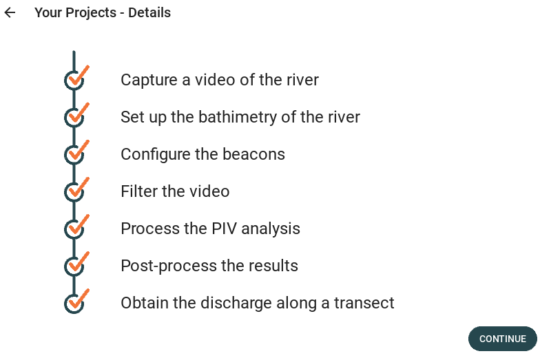

.. _project_details:

################################
Project details
################################

This screen is a transitory screen between the project managing screen and the beginning of the project configurations.
It represents a timeline of all the project details that already have been set up by the user, as shown in the figure below.

    Project details screen

If the user wants to change project, he can go back and then select another project.
If not, he can continue by clicking the "continue" button.

The screen contains the following functions:

* **_display_steps_done**: Add the view of the steps that have already been done by the user.
* **continue_project**: Continue to the next screen.