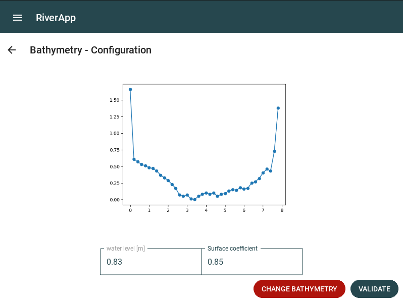

.. _bathymetry:

##########################################
Bathymetry configuration
##########################################

On this screen, you configure the bathymetry file, as well as the surface coefficient of the bathymetry.
The bathymetry has to be in a certain format to be read by RiverApp, here is an example from a bathymetry file for the river Dyle in Limelette:

.. code-block:: text

    x,y
    0,1.66
    0.2,0.61
    0.4,0.57
    0.6,0.53
    0.8,0.51
    1,0.48
    1.2,0.47
    1.4,0.43
    1.6,0.37
    1.8,0.33
    2,0.29
    2.2,0.23
    2.4,0.17
    2.6,0.07
    2.8,0.05
    3,0.07
    3.2,0.01
    3.4,0
    3.6,0.05
    3.8,0.08
    4,0.1
    4.2,0.08
    4.4,0.1
    4.6,0.05
    4.8,0.08
    5,0.09
    5.2,0.13
    5.4,0.15
    5.6,0.14
    5.8,0.18
    6,0.16
    6.2,0.17
    6.4,0.25
    6.6,0.27
    6.8,0.32
    7,0.4
    7.2,0.46
    7.4,0.43
    7.6,0.73
    7.8,1.38

As you can see, there is a measurement every 20 cm, and the first line is the header, with the x and y values.

When you measure the bathymetry of a river, you will have measures of the depth at different points, and you will have to convert these measures to the format above.

To do so, you have to take the deepest point of the bathymetry and subtract all the other points to this value to obtain a valid y value.
The water level you have to enter is the water level at the time of the bathymetry measurement, which correspond to you first deepest value.

In the example below, the deepest point was 0.83m, so the water level is 0.83m.

    Bathymetry configuration screen example, after loading the batymetry