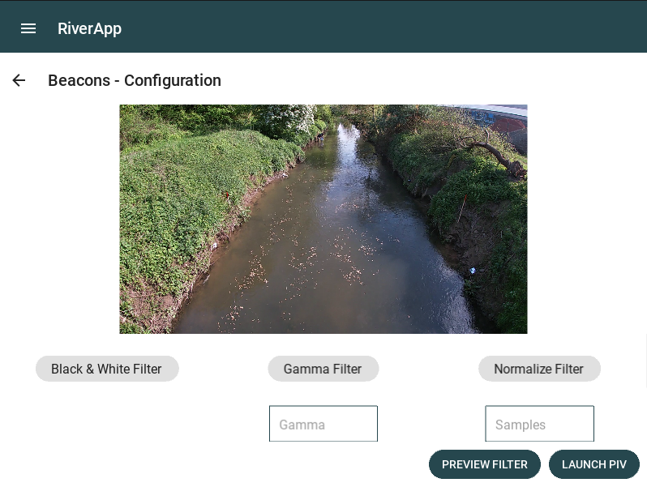

.. _filters:

######################################
Filters configuration
######################################

The goal of the filters are to apply filters on the video before processing the PIV analysis.
This feature is not working yet.

You can directly process to the PIV analysis by clicking on the "LAUNCH PIV" button.

