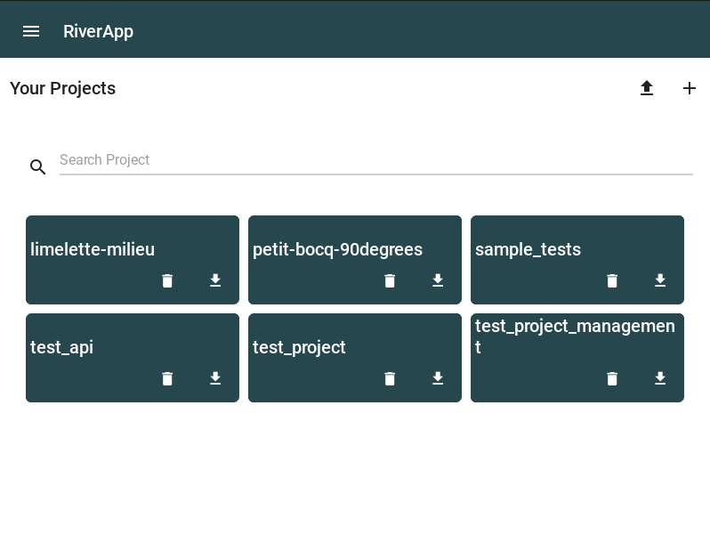

.. _projects:

#######################
Projects management
#######################

Below, you can see the screen to manage projects. You can create, edit, delete and filter projects.

Everytime you create a project, it creates a folder with the project name in the projects folder, as well as a project file containing all the configuration you will define later.

There is also a download function, but it is not working yet.
If you click on a project that is already created, you will arrive on the screen where you left.

    Project management screen

