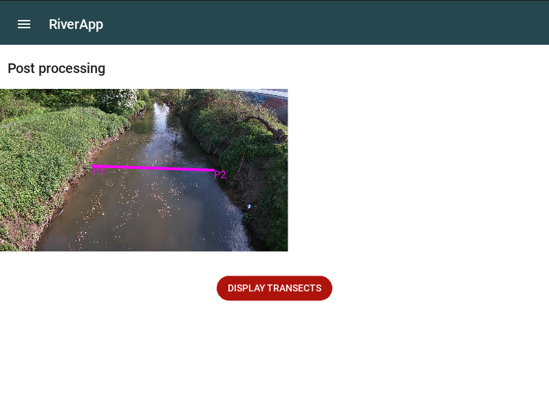
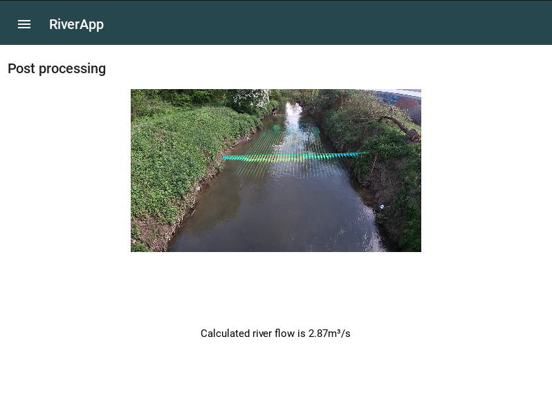

.. _transect:

##########################################
Transect configuration and river flow
##########################################

As you can see below, the transect configuration is similar to the beacons one.
The only difference is that the transect is a straight line.

The transect will define the line along which the river flow will be calculated and displayed.

To get the best results, it is recommended to place the transect only on the water surface and not on the river bed.
The application will itself go further and calculate the river flow at the water surface on the designated line.

   Transect configuration

Then, you can click on the "Display transects" button to get the river flow.
The vector field will be displayed on the river bed and the river flow will be displayed on the transect line.

A text box will also display the calculated river flow value.

   Displayed transects

