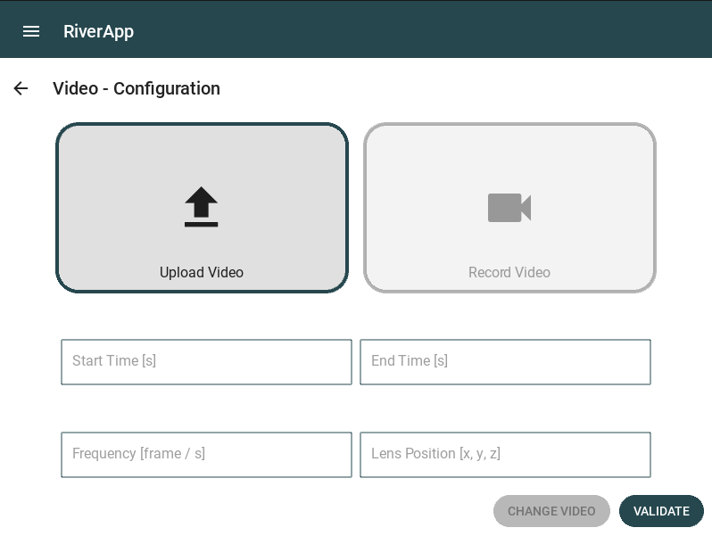
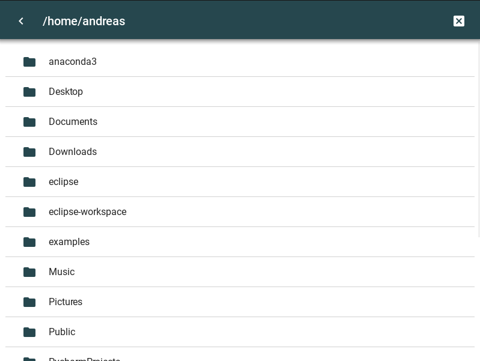
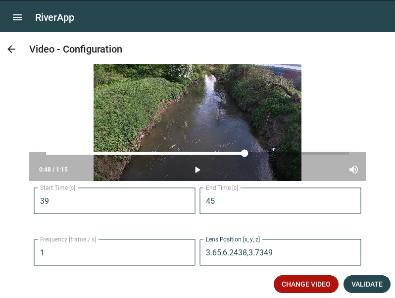

.. _video_configuration:

#########################################################
Video configuration
#########################################################

Here, you can see the first step to configure your new project.

You have to chose the video you want to analyze. You can do it by clicking on the "Upload video" button.
It will open a file explorer as you can see on the second image.
When you have chosen your video, you have to fill the following fields:

* Start time: the second of the video from which you want to start the analysis. Be careful that if the second is after a minute, you still have to write it in seconds, for example: 1m30 = 90s.
* End time: the second of the video where you want to stop the analysis. The same rule applies as for the start time.
* Frequency: the number of frames per second you want to analyze. The number that gave the better results while testing the application is simply 1.
* Lens position: the position of the camera used to film the chosen video, this parameter begins to be sensitive when the difference with reality is more than 10cms. The [x, y, z] position starts from the bottom left beacon, which means that if the bottom left beacon is in front left of the camera, the x will be positive and the y negative. The z is the height of the camera from the ground. There is no default value since the parameter changes for every measuring setup. The parameter has to be entered as a string of 3 coordinates separated by ",", for example "7,-2,3".

   Video configuration screen before the video is loaded

   File exploring screen

The following figure show the video configuration screen after the video is loaded.
You can change the chosen video but be careful that you have to change the values you already entered in the text fields.

Once you have filled all the fields, you can click on the "Next" button to go to the next step.

   Video configuration screen after the video is loaded