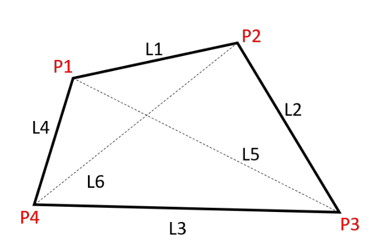
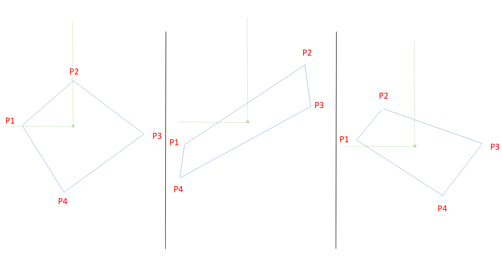
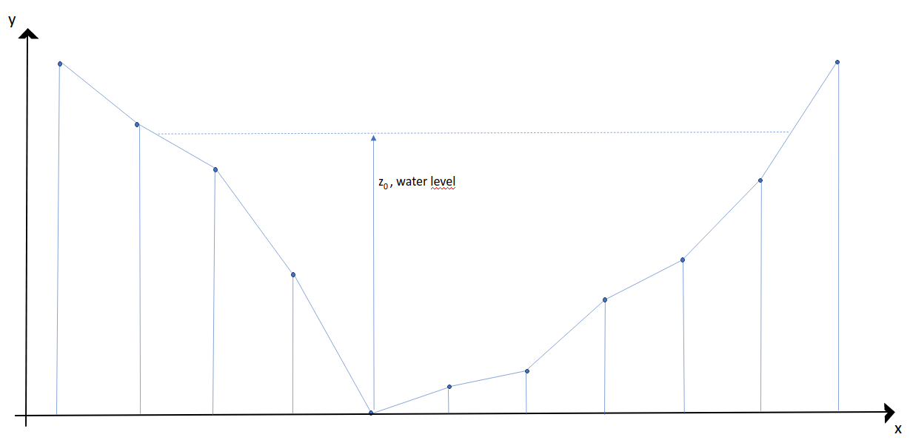

# Load files in the appropriate directory (recommended)

First, create a folder in 

	./examples/riverapp_examples/your_river/

where **your_river** is the name of your dataset
Note that everything you add in the **riverapp_examples** will be ignored by git thanks to **.gitignore**

The three following files must exists in order to launch the process.
	
    ./examples/riverapp_examples/your_river/video.mp4
	./examples/riverapp_examples/your_river/dimension.txt
	./examples/riverapp_examples/your_river/bathymetry.txt
	
# Files format (mandatory)
Then format your files with the following specifications.
### Video file
Should be a video of the river with four visible tags.

### Dimension file
A file containing one line with the 6 distances :
	
	L_1, L_2, L_3, L_4, L_5, L_6

where these distances refers to the distances between the reference points P1,P2,P3 and P4 (P1 top left corner then clockwise order)\
Note that the number should be separated with a comma\
Note that a line starting with '#' will be ignored

The points should be labeled as in the following display

As you see it on the picture, the top right point should always be the first one. Then the following go on in clockwise order.\
Note that the position of the points doesn't depend on the orientation of the river but on the view of the camera. Therefore, it doesn't matter if the river inflow through L1 or L2 (or even L3 or L4) as long as the points display on the video with these specific positions.

There might be ambiguity on which point is the top right corner as the following scenarii show on image.\
In case of ambiguity (i.e. not exactly one point in the second quadrant), take the left point as **P1**. \
If an ambiguity remains, see the sorting rules in the **sort_src()** in **dev/utils/GCP_detection.py** and note that the first principle of the rule is: a unique point in the second quadrant around the centroid of the polygon is always **P1**.

### Bathymetry file
A file containing the (x,y) coordinates refering to the depth of the river along a section of the river

	x,y
	x1,y1
	x2,y2
	...
Note that the the first line of that file should be **x,y** \
Note that the number should be separated with a comma (**,**)

Note that the x-coord refer to the coordinate along the section of the river and the y-coord refer to the depth of the river as shown on the picture.\
Note that the deepest point of the river should have a y-coord equal to zero.
Note that the water level will therefore be taken from that point.

